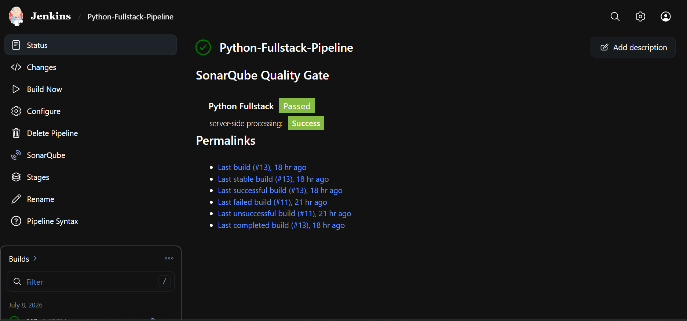
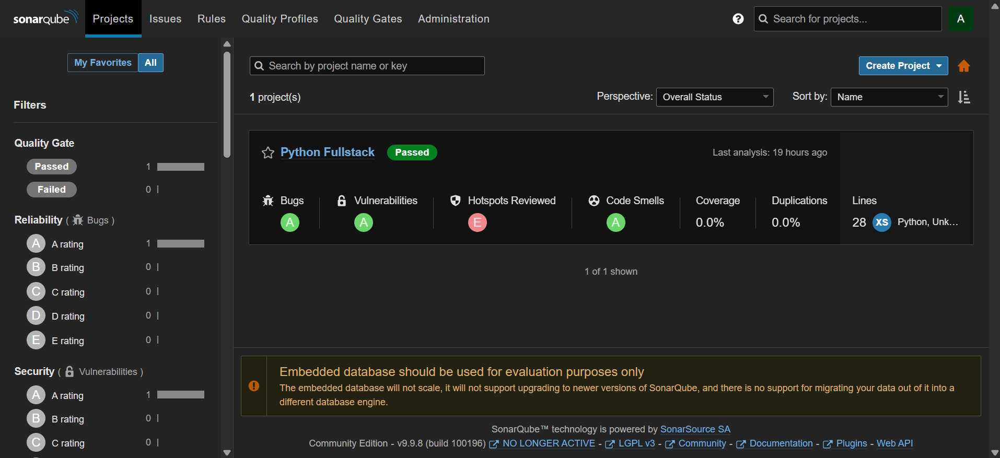
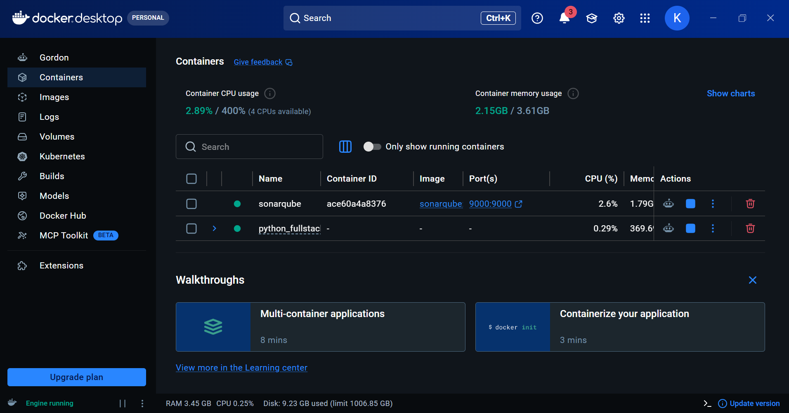
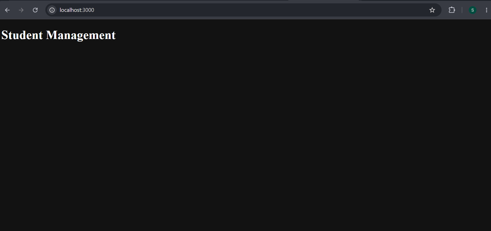

# Python Full Stack CI/CD Assignment

# Project Overview

This Project demonstrates a complete CI/CD pipeline for a Python Fullstack application using Jenkins, Docker, Docker Compose and SonarQube. The pipeline automates building, testing, code quality analysis, Docker image creation and deployment.

# Technology Stack

- Backend: FastAPI
- Frontend: React
- Database: PostgreSQL
- CI/CD Tool: Jenkins
- Containerization: Docker & Docker Compose
- Code Quality: SonarQube

# Installation Steps

1. Clone the repository.
2. Install backend dependencies:
   cd backend
   pip install -r requirements.txt
3. Install frontend dependencies:
   cd ../frontend
   npm install
4. Start the application:
   docker compose up -d      

# Jenkins Setup

- Installed Jenkins
- Installed required plugins (Git, Pipeline, Docker, SonarQube Scanner)
- Created a pipeline job.
- Connected the GitHub repository.
- Used "Pipeline script from SCM"
- Successfully executed the pipeline.

# Pipeline Explanation

The Pipeline contains the following stages:
1. Checkout Source Code
2. Install Backend Dependencies
3. Install Frontend Dependencies
4. Run Backend Tests
5. Build Frontend
6. SonarQube Analysis
7. Build Docker Images
8. Deploy using Docker Compose
9. Smoke Test
10. Cleanup

# Docker Commands

- docker compose build
- docker compose up -d
- docker compose down 
- docker ps

# SonarQube Configuration

- Started the SonarQube server
- Created a project
- Generated a project token
- Added the SonarQube server and token in Jenkins
- Ran SonarQube Analysis through the Jenkins Pipeline

# Screenshots

## Jenkins Successful Pipeline

## SonarQube Dashboard

## Docker Containers Running

## Application Running

# Challenges faced

During this project, I have faced several challenges:
- Resolving Git merge conflicts in the README.md file
- Configuring the GitHub webhook to trigger Jenkins builds automatically
- Setting up Jenkins Pipeline and installing the required plugins
- Integrating SonarQube with Jenkins for code quality analysis
- Building and running the Docker container successfully
- Debugging Pipeline errors and verifying successful builds

# Conclusion

This project successfully implemented a complete CI/CD pipeline using Git, GitHub, Jenkins, Docker, and SonarQube. The pipeline automates code checkout, build, testing, code quality analysis, deployment, improving software quality and reducing manual effort.

